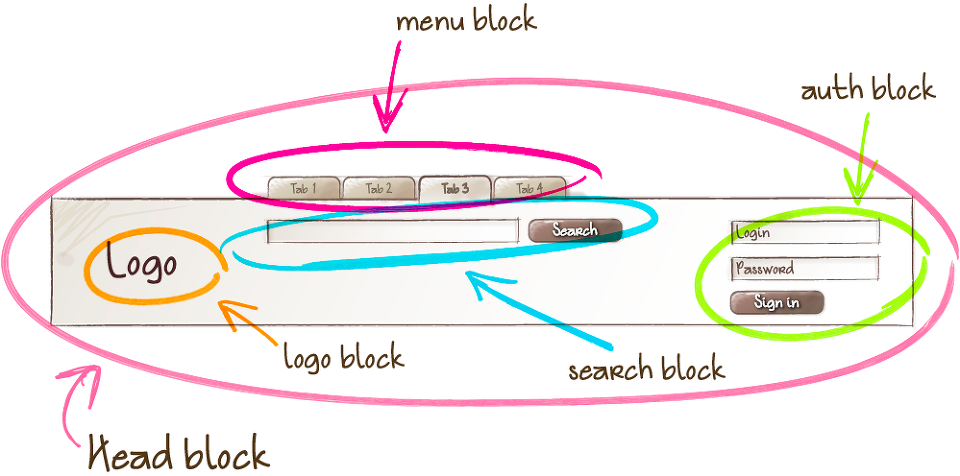
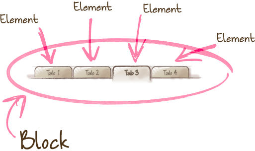
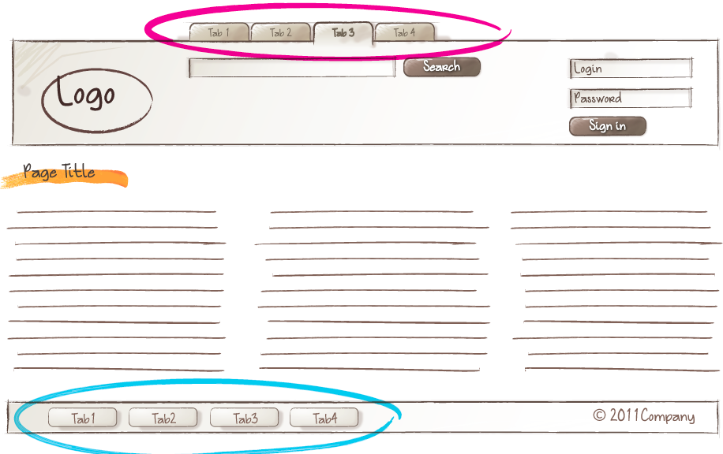

# **BEM** #

## **1. BEM의 기본구조**
BEM은 Block, Element, Modifier를 뜻하며, 각각 __ 와 -- 로 구분

    .header__navigation--navi-text {
        color: #232323;
    }

header는 **Block**, navigation은 **Element**, navi-text는 **Modifier**

BEM은 Class만을 사용하며, **어떤 목적인가**에 따라 네이밍함

이름을 연결할 때는 block-name 처럼 하이픈을 하나만 사용하여 연결함

 

## **2. Block / Element / Modifier**

## **Block** ##

**재사용이 가능한 기능적으로 독립적인 페이지 컴포넌트**(A functionally independent page component that can be reused)

어딘가에 종속되지 않고, 여기저기에서 사용할 수 있음

**Head block** 내에 **logo block, search block, menu block, auth block**이 감싸져 있듯이, 블럭은 블럭을 감쌀 수 있음

 

## **Element**

**블럭을 구성하는 단위**로 의존적인 형태

자신이 속한 블럭 내에서만 의미를 가지기 때문에 블럭 안에서 떼어다 다른곳에서 사용할 수 없음

    <ul class="nav">
        <li class="nav__item">
            <a href="#" class="nav__link">Tab 1</a>
        </li>
        <li class="nav__item">
            <a href="#" class="nav__link">Tab 2</a>
        </li>
        <li class="nav__item--selected">
            <a href="#" class="nav__link">Tab 3</a>
        </li>
        <li class="nav__item">
            <a href="#" class="nav__link">Tab 4</a>
        </li>
    </ul>
.nav는 블럭, .nav__item은 엘리먼트

 

## **Modifier**

**블럭이나 엘리먼트의 속성**을 담당

생긴 게 조금 다르거나, 다르게 동작하는 블럭이나 엘리먼트를 만들 때 사용함

    <ul class="nav">
        <li class="nav__item">
            <a href="#" class="nav__link">Tab 1</a>
        </li>
        <li class="nav__item">
            <a href="#" class="nav__link">Tab 2</a>
        </li>
        <li class="nav__item--selected">
            <a href="#" class="nav__link">Tab 3</a>
        </li>
        <li class="nav__item">
            <a href="#" class="nav__link">Tab 4</a>
        </li>
    </ul>

**Boolean**
<ul>
    <li>modifier의 유무가 중요할 때 사용됨 ex) disabled, selected 등</li>
    <li>modifier의 풀 네임 구조는 아래 패턴을 따름
        <ul>
            <li>block-name_modifier-name</li>
            <li>block-name__element-name_modifier-name</li>
        </ul>
    </li>
</ul>

**Key-value**
<ul>
    <li>modifier 값이 중요할 때 사용됨 ex) theme-special, color-red 등</li>
    <li>modifier의 풀 네임 구조는 아래를 따름
        <ul>
            <li>block-name_modifier-name_modifier-value</li>
            <li>block-name__element-name_modifier-name_modifier-value</li>
        </ul>
    </li>
</ul>

 

___

**참고사이트** 
[https://nykim.work/15](https://nykim.work/15) 
[https://velog.io/@yesdoing/BEM-Block-Element-Modifier-Quick-start](https://velog.io/@yesdoing/BEM-Block-Element-Modifier-Quick-start)